 

 
 

<h1></h1>

  <b>Software Developer focused on engineering robust client-side interfaces and high-performance server architectures.</b>

  Passionate about logical development and building modern digital experiences with a commitment to code quality, scalability, and system performance.

 

 

### TECHNICAL SPECIFICATIONS

**DEVELOPMENT STACK**

  
  
  
  
  
  
  
  

 

**INFRASTRUCTURE AND SYSTEM ADMINISTRATION**

  
  
  
  

 

**QUALITY AND STANDARDS**

  
  
  

 

 

### PROFESSIONAL PHILOSOPHY & COLLABORATION

  <b>CLEAN ARCHITECTURE & RESEARCH</b>
   
  Deeply committed to architectural excellence and continuous technological research.

  <b>TEAM PLAYER</b>
   
  Thrives in collaborative environments, believing that collective intelligence drives the best results in complex projects.

  <b>TEAM-DRIVEN PROJECTS</b>
   
  Experienced in working within agile teams, focusing on knowledge sharing and joint problem-solving.

 

 

### ANALYTICS AND PERFORMANCE

  

 

  

 

  

 
 

  

