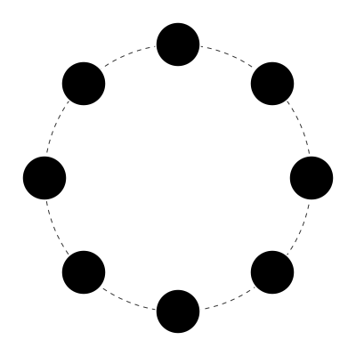

 

 
 

<h1></h1>

  <b>Software Developer focused on engineering robust client-side interfaces and high-performance server architectures.</b>

  Passionate about logical development and building modern digital experiences with a commitment to code quality, scalability, and system performance.

 

 

### TECHNICAL SPECIFICATIONS

**DEVELOPMENT STACK**

  
  
  
  
  
  
  
  

 

**INFRASTRUCTURE AND SYSTEM ADMINISTRATION**

  
  
  
  

 

**QUALITY AND STANDARDS**

  
  
  

 

 

### PROFESSIONAL PHILOSOPHY

  <b>CLEAN ARCHITECTURE</b>
   
  Prioritizing separation of concerns and maintainability in every project.

  <b>PERFORMANCE OPTIMIZATION</b>
   
  Ensuring low latency and efficient resource management across the full stack.

  <b>USER-CENTRIC DESIGN</b>
   
  Building intuitive interfaces that solve real-world problems with elegance.

 

 

### ANALYTICS AND PERFORMANCE

  

 

  

 

  

 
 

